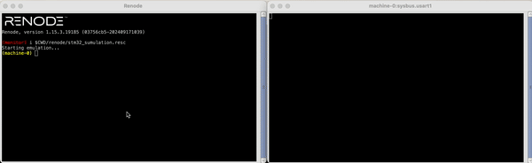

# UART_Controlled_LED_I2C

The project is designed to control LEDs via UART and read data via I2C using the STM32F103CBTx microcontroller. The main features include:

- `Turning the LED1 on/off` using the command `on/off led1` through usart1.

- `Turning the LED2 on/off` using PWM and the command `on/off led2` through usart1.

- `Reading data` from an I2C device using the command read i2c and outputting the data to UART through usart1.

## Configuration
GPIO (LEDs)
- `LED1`: GPIOA Pin 5

- `LED2`: GPIOA Pin 6 (PWM)

UART: USART1

- `Baud Rate`: 115200

- `Word Length`: 8 bits

- `Stop Bits`: 1

I2C: I2C1

- `Clock Speed`: 100000 (Standard mode)

- `Addressing Mode`: 7-bit

- `Own Address`: 0x00

TIM3 (PWM for LED2)

- `Prescaler`: 0

- `Counter Mode`: Up

- `Period`: 255

## Demo

### Build

### Usage [Renode]

